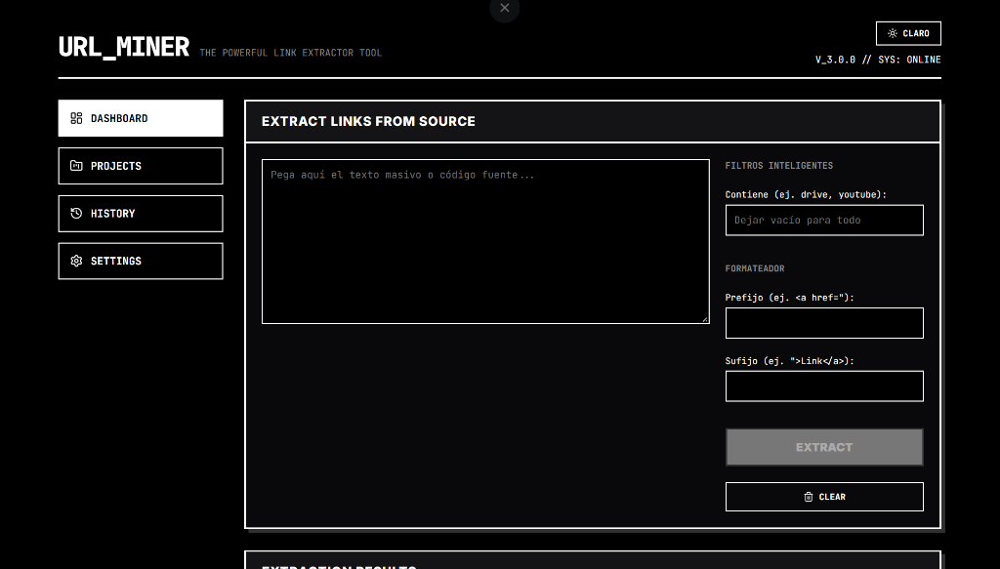
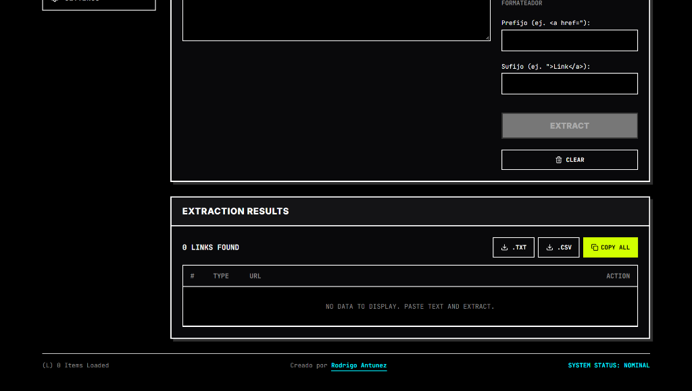

# URL-Miner

  
    
  
   
  
<strong>A lightning-fast, privacy-first web utility for bulk extracting, filtering, and formatting URLs.</strong>

  <a href="https://rodria45.github.io/URL-Miner/"><strong>Live Demo</strong></a>

---

## English

### Overview
**URL-Miner** is a highly efficient client-side tool designed to process massive blocks of text or raw HTML to extract and manipulate hyperlinks. Built with a strict **privacy-first** approach, all processing occurs directly in your browser without any server-side data transmission. 

Featuring a modern **Neo-Brutalist** tech-dark aesthetic, the tool provides a seamless, developer-friendly experience.

### Key Features
- **Bulk Extraction:** Automatically filters residual text and isolates valid URLs from chaotic raw data.
- **Smart Domain Filtering:** Real-time filtering (e.g., `youtube`, `drive`) to extract only the target domain.
- **Batch Formatting:** Inject custom prefixes and suffixes automatically.
- **Duplicate Handling:** Automatically identifies and removes duplicate URLs.
- **Batch Replacement:** Effortlessly find and replace string parameters across all extracted links.
- **Export Capabilities:** Export your processed data securely to `.CSV` or `.TXT or files.
- **Dual Themes:** Seamlessly toggle between Dark Mode and Light Mode.

### Tech Stack
- **[React.js](https://reactjs.org/)** - UI Library
- **[Vite](https://vitejs.dev/))** - Next Generation Frontend Tooling
- **Lucide Icons** - Clean and modern SVG icon library
- **Vanilla CSS3** - Custom Neo-Brutalist design system

### Architecture & Privacy
This application operates **100% Client-Side**/. We do not use databases, analytics, or backend APIs to process your links. Your data never leaves your machine.

---

## Español

### Resumen
**URL-Miner** es una herramienta ultrarrápida ejecutada del lado del cliente, diseñada para procesar bloques masivos de texto o código HTML crudo para extraer y manipular hipervínculos. Construida bajo un estricto enfoque de **privacidad absoluta**, todo el procesamiento ocurre localmente en el navegador sin transmitir datos a nim�ún servidor externo.

Con una estética moderna estilo **Neo-Brutalismo**, la herramienta ofrece una experiencia fluida e ideal para desarrolladores.

### Caracteristicas Principales
- **Extracción Masiva:** Filtra automáticamente texto residual y aísla URLs válidas desde datos caóticos.
- **Filtros de Dominio:** Filtrado en tiempo real (ej. `youtube`, `drive`) para extraer únicamente el dominio objetivo.
- **Formateo en Lote:** Inyección automática de prefijos y sufijos personalizados a todos los enlaces.
- **Control de Duplicados:** Identificación y eliminación automática de URLs repetidas.
- **Reemplazo Masivo:** Busca y reemplaza parámetros o palabras específicas en todos los enlaces extraídos.
- **Exportación de Datos:** Descarga los resultados de forma segura en formato `.CSV` o `.TXT`.
- **Doble Tema:** Alterna fluidamente entre el Modo Oscuro y el Modo Claro.

### Tecnologías
- **[React.js](https://reactjs.org/)** - Biblioteca de Interfaz de Usuario
- **[Vite](https://vitejs.dev/)** - Herramienta de construcción Frontend de nueva generación
- **Lucide Icons** - Biblioteca moderna de iconos SVG
- **Vanilla CSS3** - Sistema de diseño personalizado Neo-Brutalista

### Arquitectura y Privacidad
Esta aplicación opera **100% Client-Side** (del lado del cliente). No utilizamos bases de datos, analíticas ni APIs en servidores traseros para procesar los enlaces. Tus datos jamás abandonan tu computadora.